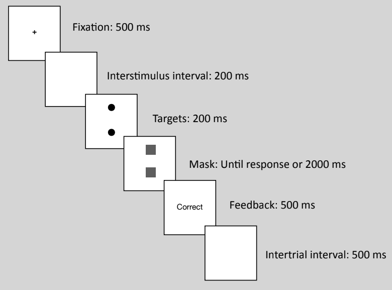
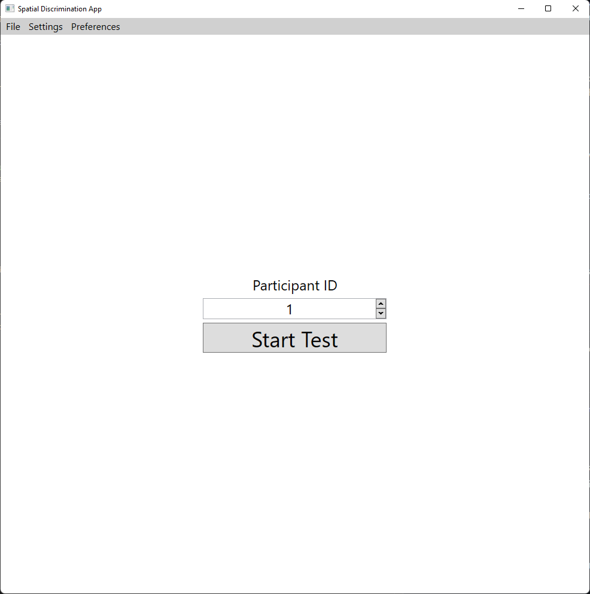
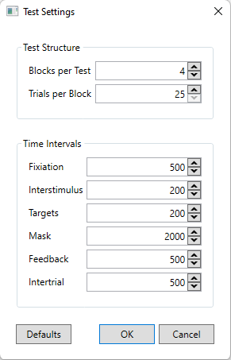

# Psychology Research Project - Spatial Discrimination

An application for a psychology research project the assess a participant's accuracy to spatially discriminate along the vertical and horizontal axes and records the test results in an Excel spreadsheet.

## Background

"Previous research has shown that dominant individuals frequently think in terms of dominance hierarchies, which typically invoke vertical metaphor 'upper' and 
'lower' class, thusly was predicted that when presented with stimuli, would more accurately discern shapes/patterns on the vertical axis..."

Essentially, in the case of:
* Size differentiation (size of dot vs. another different sized dot)
* Character differentiation (`p` vs. `q`)

We want to determine whether or not dominant people can more accurately discern these differences on a vertical axis, than those who are not dominant.

## The Test
This section covers how a test is structured and the different phases of a trial.

### Test Structure
A single test is divided into multiple blocks where each block contains 25 trials.

* Each block tests along one orientation, either the horizontal or vertical axis. The first block's orientation is randomly selected then the subsequent blocks have alternating orientations. 
* Each trial contains a pair of target stimuli: two dots of different or equivalent sizes. The order of the pairs are randomly determined for each block.

### Trial Flow
Once a test is launched, detailed instructions are displayed to the participant where once they are ready, can start the test. 

A trial has six phases: Fixation, Interstimulus, Targets, Mask, Feedback, and Intertrial phases. A flow diagram of the phases is displayed below.

<figure>
    
    <figcaption>A diagram showcasing the flow of a trial, the order of its phases, and each phase's established time intervals in milliseconds.</figcaption>
</figure>

1. **Fixation**: A fixation target is displayed to get the participant's focus to the centre of the display.
2. **Interstimulus**: Empties the display to ready the participant for the targets.
3. **Targets**: Displays a pair of target stimuli on the horizontal or vertical axis. 
4. **Mask**: Covers the pair of targets and the participant can enter their response.
5. **Feedback**: Gives the participant feedback on their response if it was correct or incorrect.
6. **Intertrial**: Clears the display to ready the next trial.

Once all trials are completed, the `Test Window` will close and return to the `Main Window`.

Once returned to the `Main Window` the app will record the test results in an Excel spreadsheet.

## Installation
1. Go to the repo's [Releases](https://github.com/critch646/PsycResearchProj_SpatialDiscrimination/releases) page and select the latest release.
2. Download both the `setup.exe` and `Setup.Spatial.Tester.msi` installers.
3. Run the `setup.exe` installer. This will install both the Spatial Discrimination App and its dependencies.

## Usage
The Spatial Discrimination App has been tested on Windows 11, but should work on Windows 7 and newer.

Either in on your `Desktop` or in the `Start Menu` find the `Spatial Discrimination App` shortcut launch the app from there.

### The Main Window
The application starts with the `Main Window`. Here you can change settings and preferences, select a participant ID number, and launch the test.

<figure>
    
    <figcaption>The Spatial Discrimination App's main window with File, Settings, and Preferences in the menu bar, a participant ID box, and a Start Test button.</figcaption>
</figure>

#### Menu Bar
From here, you can modify certain test settings by going to `Settings > Test Settings`. 

Under `Preferences` there is the `Auto Increment Participant ID` feature which, after a successful test, increments the current value in the `Participant ID` box.

Under `File` we can simply close the application.

#### Participant ID and Start Test
Clicking the `Start Test` button will launch the `Test Window` where a spatial test is generated using the current value of the `Participant ID` box. 

The `Test Window` will display the test instructions for the participant.

### Test Settings
The `Test Settings Window` allows you to change some values used for the test, such as number of trials, blocks, and the time intervals for each phase of a trial.

<figure>
    
    <figcaption>The Spatial Discrimination App's test settings window with options to modify the test structure, and time intervals.</figcaption>
</figure>

#### Test Structure
Sets the values for two parts of a test: blocks per test and trials per block
* **Blocks per Test**: The number of blocks per test. Multiples of 2 with a minimum of 2 and a maximum of 10.
* **Trials per Block**: The number of spatial trials in a block. Either 25 or 50 trials per block.

#### Time Intervals
Sets the values for timers used during each phase of a trial. Each interval can be selected to a minimum of 100 milliseconds to a maximum of 10,000 milliseconds.

### Test Results
The test results will be recorded in a single Excel workbook, where each participant's results will have its own sheet. The workbook can be found in the current user's `Documents` folder with the name `TestResults.xlsx`.

### Settings and Preferences Preservation
The app stores the users preferences and settings in `settings.json` located in the same directory as the executable file.

## Known Issues
This section lists known issues with the application.

* *Tests with the same Participant ID*: If a second test is completed with a previous participant ID, the app will create an new sheet with the same ID, but with a unique ID appended on the end. This seems to cause the workbook to get corrupted and when you open the workbook ti will ask if you wish to recover. It can successfully recover the workbook with no missing data.
* *TestResults.xlsx is open elsewhere when the app writes to the workbook*: Avoid keeping the Excel workbook open when testing, as this blocks the app from having access to the file.

## Technologies:
The Spatial Discrimination App uses the following technologies:

* **Language**: C# 10.0
* **Platform**: .NET 6.0
* **Graphical Framework**: Windows Presentation Foundation 6.0.8
* **Installer Build Tool**: Microsoft Visual Studio Installer Projects 2022 2.0.0
* **Packages**:
    - Document Format OpenXML 2.17.1
    - Extended WPF Toolkit 4.3.0
    - log4Net 2.0.15
    - Microsoft Windows Compatibility 6.0.0
    - Newtonsoft JSON 13.0.1

## Contributors
* Zeke Critchlow - Software Engineer

## Research Team
* Jeffrey Nicol - Lead Researcher
* Luke Claydon - Assistant Researcher
* Lynne-Anne West - Assistant Researcher

## License
[MIT](LICENSE) © Zeke Critchlow
